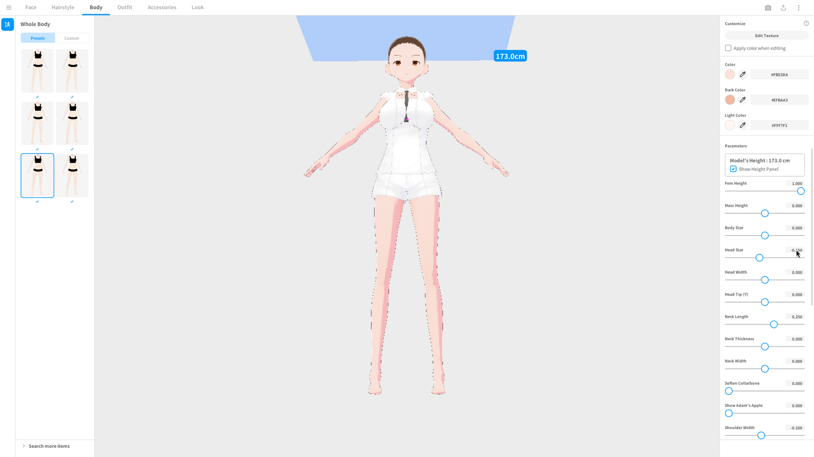
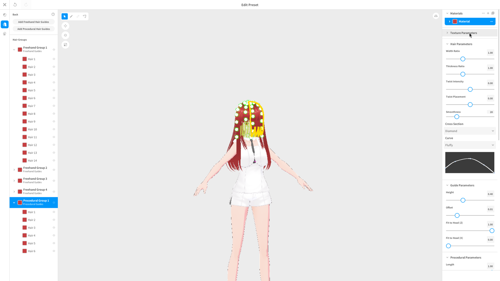
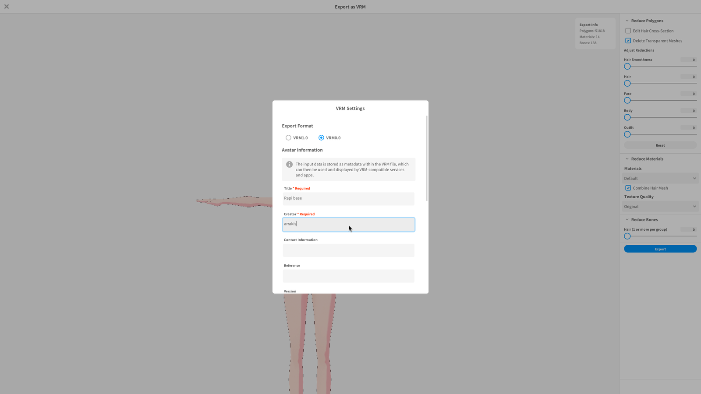

# mcp-vroid

**Drive VRoid Studio from any MCP client, on Linux/Wayland.** Launch the app,
look at it, find widgets in the picture, click and type, set parameters, and
export a `.vrm` — all as MCP tools.

## Why

VRoid Studio has no scripting API, no CLI, no plugin surface. The only way in
is the one a person uses: look at the window and move the mouse. So that is
what this does — screenshot the window with `grim`, locate things with OCR and
colour matching, and inject real pointer and keyboard events at the compositor
level. The MCP client's model is the eyes; these tools are the hands.

```
   grim ──► PNG ──► tesseract / cv2 ──► (x, y) ──► virtual pointer / XTEST
    ▲                                                        │
    └────────────────────  screenshot again  ◄───────────────┘
```

## Demo

Everything below was done by an MCP client calling these tools — no human at
the mouse.

Setting body parameters by typing exact values into the Parameters panel
(`vroid_open_tab("Body")` → `vroid_set_slider("Head Size", -0.15)`):



Inside the hair editor, tuning procedural hair guides (`vroid_click` on the
group, `vroid_set_slider` on Height / Interval / Twist Intensity):



Filling the VRM Settings modal on the way to an export (`vroid_export_vrm`
walks the whole flow, including Wine's save dialog):



## Requirements

Developed and tested on **Arch Linux + Hyprland**, with VRoid Studio 2.14.0
(English UI) running under **Steam/Proton**. What is actually load-bearing:

| | needed for | how portable |
|---|---|---|
| **Hyprland** ≥ 0.55 | window discovery, focus, workspaces, closing the screensaver — via `hyprctl` and its Lua dispatch API | **Hyprland-specific.** All of it lives in `src/mcp_vroid/driver/window.py`; a Sway port is a `swaymsg` rewrite of that one file. |
| `grim` | screenshots | any **wlroots** compositor (`wlr-screencopy`) |
| **`zwlr_virtual_pointer_unstable_v1`** | moving and clicking the real cursor | any **wlroots** compositor |
| **Xwayland** (`DISPLAY`) | keyboard and wheel, via X11 **XTEST** | any Wayland session with Xwayland |
| `tesseract` + `eng` traineddata | OCR — the entire locating story | portable |
| `gcc`, `wayland-scanner`, `libwayland-client` | building the pointer helper | portable |
| **VRoid Studio** via Steam/Proton (appid `1486350`) | the app being driven | the Steam launch path is assumed; a native/Wine install needs the launch command changed |
| Python **3.11+** and [`uv`](https://docs.astral.sh/uv/) | the server itself | portable |

So: **wlroots + Xwayland** for the input and capture layer, **Hyprland only**
for window management. On Arch:

```bash
sudo pacman -S grim tesseract tesseract-data-eng wayland gcc pkgconf
```

## Quickstart

```bash
git clone https://github.com/nhodges/mcp-vroid
cd mcp-vroid
uv sync                 # virtualenv + dependencies
bash native/build.sh    # builds native/vpointer  <-- REQUIRED, not optional
```

`native/build.sh` compiles a ~150-line C client for the Wayland
virtual-pointer protocol (the protocol XML is vendored under
`native/protocols/`). Without it every pointer tool fails with
`native/vpointer missing`; `vroid_status` tells you whether it is there.

Register it with Claude Code:

```bash
claude mcp add vroid -- uv run --directory /path/to/mcp-vroid mcp-vroid
```

…or with any client that takes an `mcpServers` block:

```json
{
  "mcpServers": {
    "vroid": {
      "command": "uv",
      "args": ["run", "--directory", "/path/to/mcp-vroid", "mcp-vroid"]
    }
  }
}
```

Then ask your client to call `vroid_status`, and if it looks healthy,
`vroid_launch()`.

Clients often start servers with a **sanitised environment**. This server
recovers `XDG_RUNTIME_DIR`, `WAYLAND_DISPLAY`, `HYPRLAND_INSTANCE_SIGNATURE`
and `DISPLAY` from the runtime dir at startup
(`src/mcp_vroid/session_env.py`), so `hyprctl` / `grim` / XTEST work anyway.
`vroid_status` reports what it had to fill in; anything already in the
environment wins.

Optional environment variables:

| var | default | meaning |
|---|---|---|
| `MCP_VROID_CAPTURES` | `$XDG_STATE_HOME/mcp-vroid/captures` | where screenshots are written |
| `MCP_VROID_OUT` | `$XDG_STATE_HOME/mcp-vroid/out` | default dir for exports/saves |
| `MCP_VROID_VPOINTER` | `<checkout>/native/vpointer` | path to the pointer helper |
| `MCP_VROID_MAX_IMAGE_PX` | `1600` | longest edge of images sent to the client (0 = never downscale) |

## Tools

18 tools, in four groups.

**Lifecycle**

| tool | what it does |
|---|---|
| `vroid_launch(restart=false, timeout=240)` | Start VRoid via Steam if needed, park it on Hyprland workspace 9, remember the workspace you were on, focus + fullscreen it. `restart=true` kills the running instance first — unsaved work is lost. |
| `vroid_status()` | Window present/focused/title/geometry, active workspace, capture dirs, and whether `vpointer`/`grim`/`tesseract`/`hyprctl` are available. Read-only, no OCR. |
| `vroid_release()` | Switch back to the workspace the user was on. VRoid keeps running on ws 9. |

**Seeing**

| tool | what it does |
|---|---|
| `vroid_screenshot(region?, tag?, whole_screen?, full_resolution?)` | Capture the window (or the whole output, for the Wine save dialog), save it, and return it as MCP image content for the client's model to look at. Reports native size and the downscale factor applied for transport. |
| `vroid_find_text(query, region?, exact?, limit?)` | Fresh capture + tesseract; returns matching word boxes and centres in image px. Pass `region` — full-frame OCR takes ~10 s, a panel ~2 s. |
| `vroid_find_button(color='primary'\|'disabled', label?, region?)` | Finds VRoid's solid `#0096FA` pills by colour, because tesseract loses white-on-blue labels. A grey pill means *disabled*. |
| `vroid_current_screen()` | `start` / `editor` / `export_vrm` / `hair_editor` / `unknown`. |

**Acting — raw input**

| tool | what it does |
|---|---|
| `vroid_click(x, y, space='image', button='left', double=false)` | Glides the pointer in a few steps (so hover states fire) and clicks. |
| `vroid_drag(x1, y1, x2, y2, space='image', button='left')` | Press → 24-step glide → release. Right-drag orbits the camera, middle-drag pans. |
| `vroid_scroll(dy, dx=0, x?, y?, space='image')` | Wheel, as X11 buttons 4/5 (6/7 horizontal). Park the pointer over the panel you mean to scroll. |
| `vroid_type(text, clear_first=false)` | Types into the focused widget over XTEST. |
| `vroid_key(combo, times=1)` | `Return`, `Escape`, `ctrl+s`, `ctrl+shift+s`, … |

**Acting — flows**

| tool | what it does |
|---|---|
| `vroid_new_character(base='Fem'\|'Masc')` | Start screen → Create New → base → editor. |
| `vroid_open_tab(name)` | Face / Hairstyle / Body / Outfit / Accessories / Look. |
| `vroid_set_slider(label, value)` | Scrolls the Parameters panel to the row and types an exact value into its numeric box. |
| `vroid_set_color(label, hex)` | Same, for a `#RRGGBB` colour box. |
| `vroid_export_vrm(path, avatar_name, creator, version='1.0')` | The whole Export-as-VRM walk, including the VRM Settings metadata modal and Wine's save dialog. `version` picks VRM1.0 or VRM0.0. |
| `vroid_save_project(name?)` | Ctrl+Shift+S to an explicit `.vroid` path, or a plain Save with no argument. |

Every acting tool focuses VRoid first and **refuses to act if the focused
window is not VRoid Studio**.

## How it works

The loop is **see → locate → act → see again**:

1. `vroid_launch()`
2. `vroid_screenshot()` — the image goes to the client's model, which *looks* at it
3. `vroid_find_text("Export")` or `vroid_find_button()` for coordinates
4. `vroid_click(x, y)` — always with coordinates from a *fresh* capture
5. `vroid_screenshot()` to confirm what actually happened

**Seeing** is `grim` on the Hyprland window geometry, then tesseract for word
boxes and OpenCV for solid-colour buttons (VRoid's primary pills are
`#0096FA`, and OCR reliably loses white-on-blue labels).

**Acting** goes down two different paths, for annoying reasons:

* *Pointer* — a small C client (`native/vpointer.c`) speaking
  `zwlr_virtual_pointer_unstable_v1`. It moves the real compositor cursor, so
  hover states and drags behave exactly as they do for a human, and it needs
  no permissions: `ydotool`'s `/dev/uinput` route is `0600 root:root` and
  would need sudo or a udev rule.
* *Keyboard and wheel* — X11 **XTEST** through Xwayland, because the
  virtual-pointer protocol has no keyboard counterpart and VRoid is an
  Xwayland client anyway.

**Coordinate spaces.** Three are in play and they are all different:

| space | size on the reference machine | who uses it |
|---|---|---|
| Hyprland **layout** (logical) | 2048 × 1152 | `hyprctl`, the virtual pointer |
| **image pixels** of a capture | 2560 × 1440 | tesseract, cv2, everything you see |
| **X11** pixels (Xwayland) | 2560 × 1440 | XTEST |

Tools take and return **image px** (`space="image"`) by default and convert
internally, so `vroid_find_text` output can be handed straight to
`vroid_click`. If `MCP_VROID_MAX_IMAGE_PX` downscaled the picture you were
shown, multiply coordinates read off it by the inverse of the reported
`downscale` — or just ask `vroid_find_text`, which always reports native px.

Rules of thumb, learned the hard way:

* **Read the whole frame, not a crop.** A "Close Hairstyle Editor" confirm
  modal sat in the middle of the screen through six failed clicks because the
  check only OCR'd the top 60 px.
* **Don't judge change by the 3D viewport.** VRoid dithers every frame, so a
  full-window diff reads ~0.98 even when nothing happened. Watch a UI strip.
* **Prefer numeric boxes to slider drags.** `vroid_set_slider` types an exact
  value; dragging is for controls that have no box.
* **Primary buttons are found by colour, not text.** A grey pill where you
  expect blue is the app telling you a required field is empty.

A detailed map of VRoid's UI — tab strip, rails, panels, the export flow, the
hair editor, with measured coordinates — is in **[docs/ui-map.md](docs/ui-map.md)**.

## Limitations and brittleness

This is GUI automation with no API underneath. Be realistic about it:

* **OCR is the whole locating story**, and it is imperfect. Small,
  letter-spaced or light-on-dark labels get split or dropped (`Export` →
  `E` + `xport`). White-on-blue is lost entirely, which is why
  `vroid_find_button` exists. Icons have no text at all — those anchors are
  hard-coded fractions of the window.
* **Coupled to the UI version.** Needles and fractional anchors were
  calibrated on VRoid Studio 2.14.0, English, at 2560×1440 / scale 1.25. A
  pixiv UI reflow, another language, or a different monitor can require
  re-measuring. (Japanese UI → kebab `⋮` → Settings → Language.)
* **Modals appear outside your search region** and swallow clicks silently.
* **Timing is guessed.** The 3D viewport takes ~5 s after a base is chosen;
  export takes 5–30 s, longer for heavy models.
* **The Wine save dialog is a separate window** with its own class and
  geometry — use `vroid_screenshot(whole_screen=true)` there.
* **Single instance, single session.** One VRoid window, one desktop, no
  headless mode, no parallelism. It drives *your* screen.
* **The idle screensaver** can grab the session mid-run. The guard refuses to
  type into it and closes that one window (and only that one) before acting.
* **Attended use is recommended.** See below.

## Security

**This server injects real mouse and keyboard events into your live desktop
session and takes screenshots of it.** That is the entire point, and it is
also the risk:

* Screenshots may capture anything on the output — `whole_screen=true`
  captures everything, and captures are written to disk unencrypted.
* Keystrokes go to whatever holds keyboard focus. The driver refuses to act
  unless VRoid Studio is focused, but a careless or hostile prompt can still
  click anywhere *inside* VRoid.
* `vroid_launch(restart=true)` kills VRoid Studio and loses unsaved work.
* Nothing here is sandboxed and there is no confirmation step.

**Run it attended**, on a session you are watching. Don't run it on a shared
or multi-user machine, don't leave an agent driving it unsupervised, and treat
the captures directory as sensitive. `vroid_release()` gives the desktop back
when you're done.

## Development

```bash
uv run python scripts/smoke_test.py              # start the server, list tools, call vroid_status
uv run python scripts/smoke_test.py --screenshot # + one passive capture if VRoid is open
uv run vroid-driver shot                         # the original driver CLI, still here
```

`vroid-driver` (`mcp_vroid.driver.cli`) is a shell interface to the same
engine — `launch`, `shot`, `find`, `click`, `tab`, `slider`, `export`, `cam`,
`apply-params`, … — handy for debugging without an MCP client in the loop.

Layout:

```
src/mcp_vroid/server.py       MCP tool definitions (stdio)
src/mcp_vroid/session_env.py  recovers the Wayland/X session env
src/mcp_vroid/driver/         the engine
  window.py                   hyprctl: find / launch / focus / workspaces   <- Hyprland-specific
  capture.py                  grim + coordinate spaces
  locate.py                   tesseract OCR + colour button matching
  input.py                    vpointer (Wayland) + XTEST (X11)
  actions.py                  the VRoid-specific flows
native/vpointer.c             zwlr_virtual_pointer client
```

## Contributing

Issues and PRs welcome. Useful things to bring:

* **A port to another wlroots compositor.** Only `driver/window.py` is
  Hyprland-specific; the rest already works anywhere `grim` and
  `zwlr_virtual_pointer` do.
* **Anchors for other resolutions or DPI scales**, or for the Japanese UI.
* **Bug reports** — include your compositor, VRoid Studio version, monitor
  resolution and scale, and the output of `vroid_status`. A capture from the
  failing step helps enormously.

Nothing here is auto-formatted or linted by CI; match the surrounding style.

## Licence

MIT — see [LICENSE](LICENSE). VRoid Studio is a product of pixiv Inc.; this
project is unaffiliated with pixiv and simply drives the app's UI.
